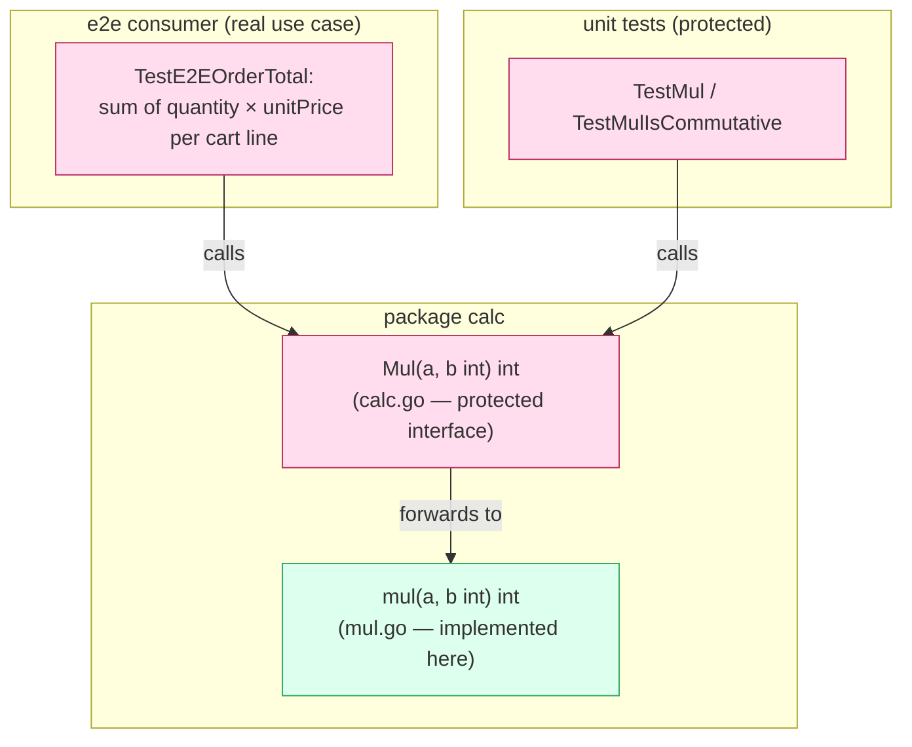

# Add `calc.Mul` — a minimal integer multiplication utility

## What this delivers

This milestone adds a tiny, well-scoped arithmetic helper to the `calc`
package: `Mul(a, b int) int`, which returns the product of two integers. It is
paired with a small end-to-end scenario that uses `Mul` the way a real consumer
would — computing a shopping-cart order total as the sum of each line's
quantity × unit price.

The change follows strict TDD. The public interface and the failing (RED) unit
and end-to-end tests are established first; implementation then makes them
green. The public surface is deliberately frozen so implementation cannot drift
from the agreed contract.

## Why

It doubles as a smoke test for the `milestone-tdd` handoff layout (assign →
approve → implement → review), while giving `calc` a genuinely useful,
composable primitive: multiplication is the natural companion to addition and
underpins common real-world math such as line-item pricing.

## Design

The public function is frozen in the protected interface file and forwards to
an unexported `mul`. The implementer only edits `mul` — the exported signature,
the unit tests, and the e2e test are protected and cannot change. This keeps
the contract stable while leaving a clear, single place to add behavior.

## Verification

- Unit tests cover positive, zero, identity, single-negative, double-negative,
  and commutativity cases.
- The e2e test exercises `calc.Mul` across a package boundary in a realistic
  pricing scenario.
- At contract time every test is RED (the `mul` stub panics); implementing
  integer multiplication turns them all green.
