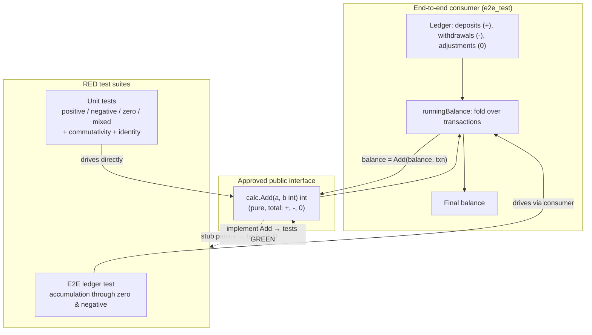

# Milestone: `calc` package with a correct `Add`

## What this delivers

This milestone introduces a small, self-contained `calc` package whose single
public primitive, `Add(a, b int) int`, returns the sum of its two operands. The
contract is defined over the **entire** integer domain: operands may be
positive, negative, or zero, in any combination, and the result is always their
arithmetic sum with no special-casing.

## Why

The module is the throwaway target for exercising vajra's `milestone-tdd`
workflow end to end. A pure, total addition function is the smallest unit that
still has meaningful behavioural requirements — sign handling and the zero
identity — making it an ideal vehicle to prove out the RED → approve →
implement → green loop. The public signature is deliberately minimal so that
the interesting work lives entirely in getting the behaviour right, not in API
surface.

## Approved contract

- `Add(a, b int) int` is a **pure, total** function: no side effects, defined
  for every pair of `int` values, always returning `a + b`.
- Correctness is required for mixed signs (e.g. `8 + (-8) == 0`), two negatives
  (e.g. `-4 + -6 == -10`), and any operand being zero (the additive identity).
- The function is commutative: `Add(a, b) == Add(b, a)`.

## Test strategy (RED)

The contract ships with tests already written and intentionally failing against
an unimplemented stub:

- **Unit tests** (`calc/calc_test.go`) drive `Add` directly with a table of
  positive, negative, zero, and mixed-sign rows, plus commutativity and
  additive-identity properties.
- **End-to-end test** (`e2e/e2e_test.go`) imports the package through its public
  module path and uses `Add` as a real downstream consumer would: accumulating a
  ledger of deposits, withdrawals, and no-op adjustments into a running balance
  that passes through zero and into the negative. This proves the function works
  in a realistic accumulation flow, not just in isolation.

The implementer's job is to replace the stub body so both suites turn green,
without modifying the interface or the tests.

## Design / flow

