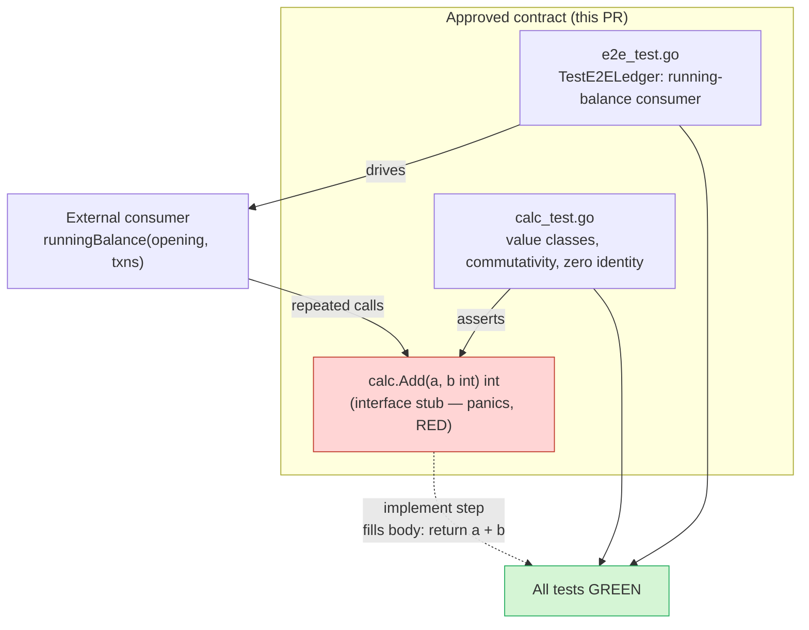

# Milestone: introduce the `calc` package

## What this delivers

This milestone establishes the first real capability of the `tdd-sandbox`
module: a small, well-documented `calc` package that exposes a single public
operation — integer addition via `Add(a, b int) int`. It is deliberately
minimal, but it is delivered under a strict test-driven contract so the
workflow exercises the full loop of *fix the contract first, make it green
second*.

## Why

The module previously shipped only `go.mod` and a README. To validate the
`milestone-tdd` pipeline end to end we need a genuine, verifiable unit of
behavior with an approved public interface, failing tests that encode the
specification before any code exists, and a realistic consumer scenario. A
pure arithmetic function is the smallest thing that still demonstrates every
part of the flow: an interface contract, property-level unit tests, and an
end-to-end test that composes the API the way an external caller would.

## Approach

The public interface is fixed up front and its behavior is pinned by tests
that fail against a stub. The unit tests assert the value classes and the
algebraic properties of addition (commutativity, zero identity). The
end-to-end test treats `calc` as an external dependency and folds a stream of
signed transactions into a running ledger balance, proving the API is usable
in a realistic composition rather than in isolation.

The contract is authored to be **RED** now: the interface stub carries no
production behavior, so both the unit suite and the end-to-end scenario fail.
A later step turns the contract **GREEN** by supplying the single-line body,
without touching the protected tests. The signature is protected implicitly —
any drift breaks compilation of the locked test files.

## Design & flow

## Verification

- **Now (contract):** `go test ./...` fails — every assertion is RED against
  the interface stub, confirming the tests encode behavior that does not yet
  exist.
- **After implement:** `go test ./...` and `go test -cover ./...` pass once the
  stub body becomes `return a + b`, with the protected tests unchanged.
