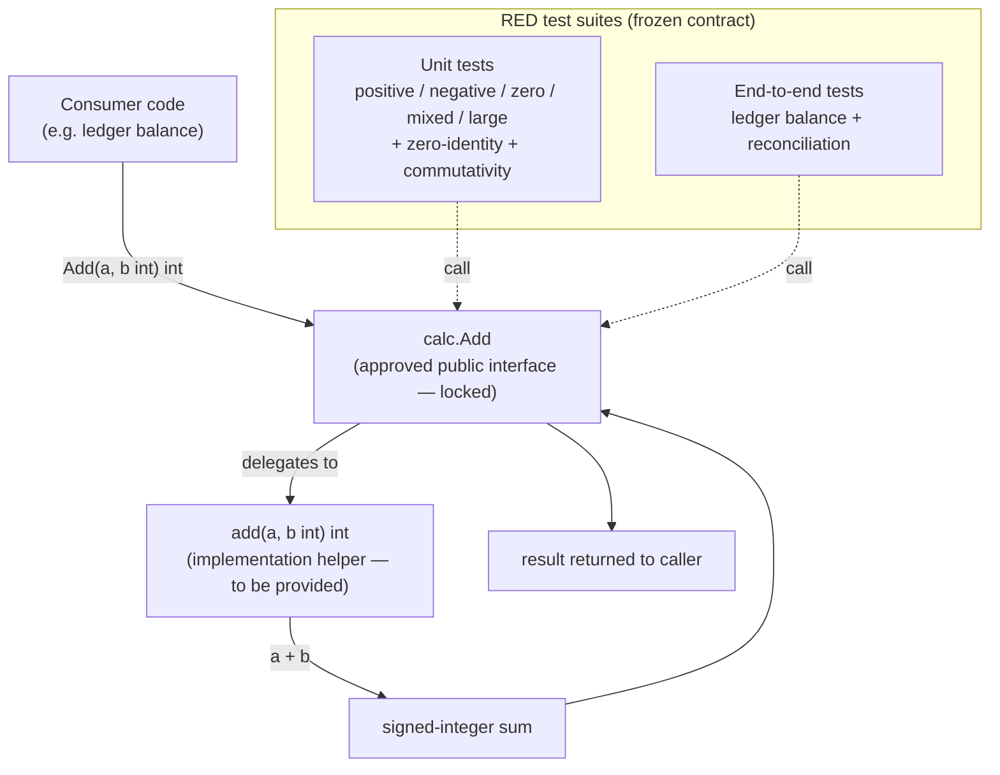

# Add the `calc` package with a signed-integer `Add`

## What this milestone delivers

This milestone introduces a small `calc` package exposing a single, well-defined
arithmetic operation: `Add`, which returns the signed-integer sum of its two
arguments. The contract is deliberately precise so that the behaviour is
unambiguous for every consumer: zero acts as the additive identity from either
side, negative operands are summed like any other value, and the operation is
commutative. In short, `Add(a, b)` is always the ordinary two's-complement sum
`a + b`, and the "handle negatives and zero" requirement falls out of that
single rule rather than being a set of special cases.

## Why it is shaped this way

The package follows a strict test-driven, contract-first flow. The approved
public interface — the exact signature `func Add(a, b int) int` and its
documented guarantees — is fixed up front and locked so it cannot drift during
implementation. The public entry point delegates to a tiny unexported helper,
which is the only piece left to implement. This keeps the reviewed surface area
minimal and stable: the caller-facing API and its tests are frozen, while the
implementation is free to be filled in until the suite goes green.

Correctness is pinned from two angles before any behaviour exists:

- **Unit tests** drive the contract directly through the public API across
  positive, negative, zero, mixed-sign and large operands, and assert the
  zero-identity and commutativity properties.
- **An end-to-end test** exercises the feature the way a real consumer would: a
  ledger folds `Add` over a stream of deposits (positive), withdrawals
  (negative) and no-op entries (zero) to produce a running balance, and a
  reconciliation scenario replays the same stream from both ends to confirm the
  result is order-independent.

Both suites are intentionally **RED** at handoff — the package does not yet
compile because the implementation helper is absent — so that turning them green
is the definition of done for the implementation step.

## Design and flow

## Definition of done

The milestone is complete when the implementation helper is supplied and both
the unit and end-to-end suites pass, with the approved public interface and the
tests left unchanged.
