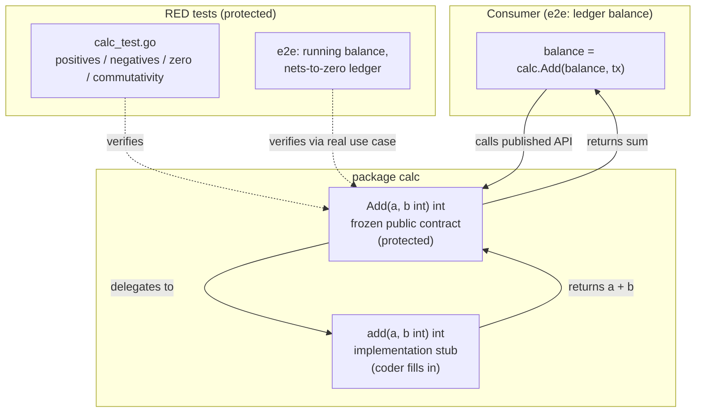

# Milestone: `calc.Add` integer addition

## What this delivers

This milestone introduces a small `calc` package that exposes a single,
well-defined arithmetic primitive:

```go
func Add(a, b int) int
```

`Add` returns the ordinary integer sum of its two arguments. The contract
explicitly requires correct behavior across the full sign space — positive
operands, negative operands, and zero — so callers can rely on it as a
predictable building block (for example, accumulating a running total over a
ledger of mixed deposits and withdrawals).

## Why

The repository is a throwaway target for exercising vajra's `milestone-tdd`
workflow end to end. This milestone establishes the first real unit of
behavior via strict test-first development: the public contract and a full set
of RED tests are frozen up front, and the implementation phase makes them go
green without touching the contract or the tests.

## Design

The public surface (`Add`) is deliberately separated from its implementation.
`Add` is the frozen, protected contract; it delegates to an unexported `add`
function that lives in a non-protected file. This gives the implementer a clear
place to write production behavior while guaranteeing the published signature
and its documented semantics cannot drift.



## Test coverage (RED until implemented)

- **Unit** (`calc/calc_test.go`): table-driven cases across positive, negative,
  and zero operands, plus a commutativity check (`Add(a, b) == Add(b, a)`).
- **End-to-end** (`e2e/calc_e2e_test.go`): simulates a real consumer computing
  a running account balance over a sequence of deposits and withdrawals using
  only `calc.Add`, asserting both the per-step and final balances.

Both suites compile and currently fail (the implementation stub panics),
establishing a clean RED baseline for the implementation phase.
