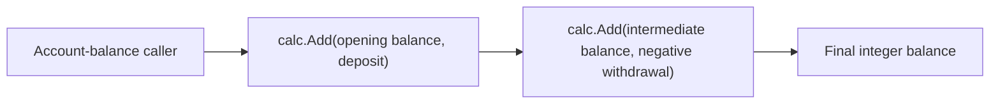

# Add integer addition to `calc`

This milestone establishes a small, dependency-free `calc` package with one focused capability: callers can combine two `int` values through a stable `Add` operation. The contract covers ordinary, negative, mixed-sign, and zero operands while keeping the API deliberately narrow—there is no state, configuration, or error channel to complicate a pure arithmetic helper.

The assignment starts with executable unit and end-to-end coverage so the expected behavior is concrete before the implementation is written. The end-to-end flow mirrors a practical account-balance calculation, applying a deposit and then a negative withdrawal through the same public operation. This gives the next implementation step a clear RED-to-GREEN target without prescribing internal structure.

Once implemented, the package provides a predictable building block that can be reused anywhere two integer quantities need to be combined, with behavior grounded in Go's native `int` arithmetic semantics.
